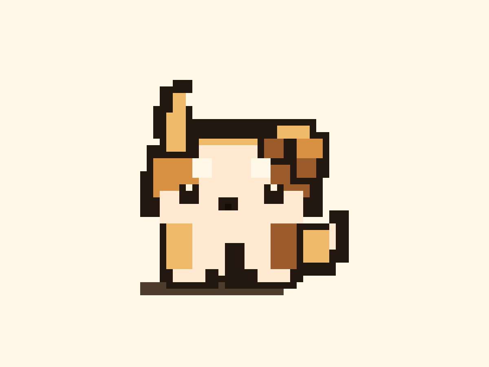

# 🐶 Miro

**A desktop pet who understands your screen.**

<p align="center">
  
</p>

Miro is a transparent, always-on-top desktop companion (Electron + PixiJS) that watches your screen and understands what you're doing — powered by **Gemma 4 31B on Cerebras** (~1,500–2,600 tok/s, ~250 ms reads). She lives over your work, walks to whatever just happened, and tells you what she saw — the failing test, the one file to open, whether it's real or a stale error — then celebrates when you fix it and remembers your day.

The magic is **latency**: at Cerebras speed her reactions feel *alive*, not like a buffering bot.

> Built for the **Cerebras × Google DeepMind Gemma 4 Hackathon** (June 2026).

## What she does

- **Watches your screen** continuously — 3-frame temporal vision, ~250 ms per read — stays calm (zero tokens) when nothing's happening, and **curls up asleep** once the screen's been quiet, waking the moment something matters (or when you pet her / press `⌘⇧L`).
- **Reacts to changes, not noise** — she fires *once* on a real transition (a test goes red, then green) and stays quiet while the same thing just sits on screen. Calm, not manic.
- **Has judgment** — a **Verifier** kills false panic on stale/cached errors, and a safety rule makes her flag a destructive command (`rm -rf`, `git push --force`) *over* a louder test failure.
- **Surfaces what she understood** — a glanceable *"what I saw"* card: the named cause, the **one file to open**, real-vs-stale, the literal error line, and any danger. (Conclusions she computes are shown, not thrown away.)
- **A coordinated agent pack** — a Verifier (best-of-N vote) gates Mood / Fetch / Guard → Nudge → Story; the Verifier kills false panic on stale errors.
- **Reacts with intent** — she *notices*, turns, **walks over**, stands *beside* the thing (never on top of it) and points, worries / guards / celebrates, then ambles back to a calm perch. Draggable; clicks pass through everywhere except her body.
- **Remembers** — recurrence (*"↻ 2nd time this session"*), a **Bond** that grows across sessions and greets you back, and an end-of-day **recap** (`⌘⇧M`).
- **Point, don't act** — she points at the problem; you stay in control.

## Why it fits the hackathon

- **Multimodal** — terminal text + screenshots (images) + 3-frame sequences (the "video" modality).
- **Multi-agent** — a genuinely *coordinated* pack (upstream verdicts gate downstream agents), with an inter-agent trace.
- **Speed in action** — ~250 ms reactions are the whole product; `race.html` runs the *same brain* on Cerebras vs a GPU baseline (Gemini) — Cerebras measured **~48× faster** on an identical call (the live GPU lane needs a valid `GEMINI_API_KEY`).

## Run it

```bash
cp .env.example .env        # paste your Cerebras key into CEREBRAS_API_KEY
npm install
npm run dev                 # starts Vite on http://127.0.0.1:5173
npm run overlay             # in a second terminal: the desktop overlay
# Vite also serves:
#   /app.html  windowed live demo
#   /race.html Cerebras-vs-GPU side-by-side
#   /          art pose preview
npm run render:miro         # regenerate demo/assets/miro-clean.png + miro-sprite.png
npm run probe               # confirm Cerebras access + real speed/token numbers
```

macOS: grant **Screen Recording** to Electron on first run. The Cerebras key is injected by the Vite dev-server proxy, so it never reaches the browser bundle.

**Controls:** drag her to move · click her body to recall the last card · `⌘⇧M` recap · `⌘⇧L` look-now / wake her.

## How it works

```
screen → change-gate + self-mask (she never reads her own overlay)
       → Retina (1 vision call → strict situation JSON; newest terminal output = current truth)
       → belief-latch (act on a NEW situation, stay calm on a repeat)
       → coordinated instinct swarm (verifier → mood/fetch/guard → nudge → story)
       → reducer (3 meters + carried concern + receipt)
       → intent machine (notice → walk → point → perch → sleep) + Bond memory
```

A stalled read self-heals (12 s request timeout + a watchdog) so she never freezes. Full architecture, verified numbers, and build status: **[PLAN.md](./PLAN.md)**. Art direction: **[ART_WORKSTREAM.md](./ART_WORKSTREAM.md)**.

## Stack

Electron · Vite · TypeScript · PixiJS · Cerebras Inference API (OpenAI-compatible, key proxied server-side).
